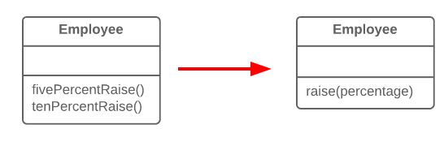

# Parametrizar Método

## Problema
Varios métodos realizan acciones similares que solo difieren en sus valores internos, números u operaciones.

## Solución
Combinar estos métodos usando un parámetro que pasará el valor necesario para unificar los métodos.

## Por Qué Refactorizar
Si tienes métodos similares, probablemente tengas código duplicado, con todas las consecuencias que esto conlleva.

Además, si necesitas agregar otra versión de esta funcionalidad, tendrás que crear otro método más. En cambio, podrías simplemente ejecutar el método existente con un parámetro diferente.

## Desventajas
A veces, esta técnica de refactorización puede llevarse demasiado lejos, resultando en un método común largo y complicado en lugar de varios más simples.

También ten cuidado al mover la activación/desactivación de la funcionalidad a un parámetro. Esto eventualmente puede llevar a la creación de un gran operador condicional que necesitará ser tratado mediante [Reemplazar Parámetro con Métodos Explícitos](../RefactoringPattern/ReplaceParameterWithExplicitMethods.md).

## Cómo Refactorizar

1. Crear un nuevo método con un parámetro y moverlo al código que es común para todas las clases, aplicando [Extraer Método](../RefactoringPattern/ExtractMethod.md). Ten en cuenta que a veces solo cierta parte de los métodos es realmente la misma. En este caso, la refactorización consiste en extraer solo la parte común a un nuevo método.

2. En el código del nuevo método, reemplazar el valor especial/diferente con un parámetro.

3. Para cada método antiguo, encontrar los lugares donde se llama, reemplazando estas llamadas con llamadas al nuevo método que incluyan el parámetro. Luego eliminar el método antiguo.
